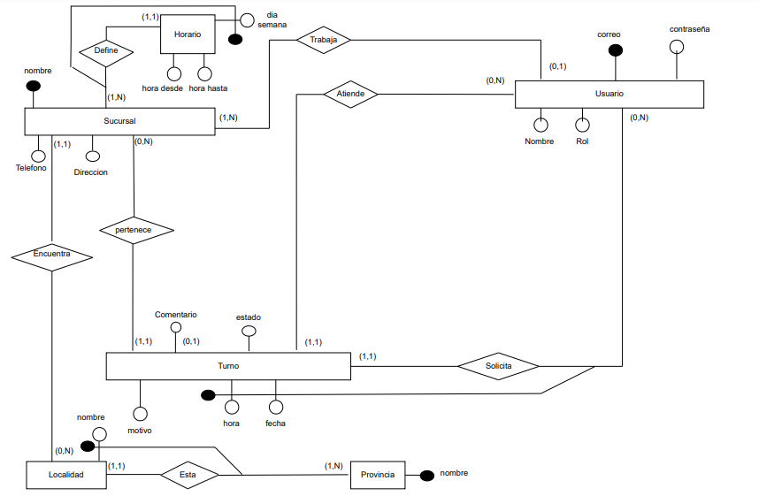

# APP del Banco

## Introduccion

Un importante banco de la Argentina está buscando modernizar la forma en que gestiona los turnos para atención presencial en sus sucursales. En la actualidad, cualquier cliente debe acercarse a la sucursal para solicitar un turno para atención y luego esperar a que se le llame. El banco quiere poder ofrecer un sistema de turnos online, para que cualquier persona pueda solicitar un turno para ser atendido en una sucursal sin necesidad de acercarse a ésta y tener que esperar a ser atendida.

## Decisiones de diseño importante

A continuacion se puede ver el modelado final:




* Existe una unica entidad usuario la cual va a tener roles (administrador, empleado, cliente)

* El horario va a ser unico en cuanto a la sucursal y un dia de la semana

* El atributo sucursal del usuario es opcional, ya que solo los empleados trabajan en las mismas

* El turno es unico en cuento al cliente, fecha y hora

* En una provincia no puede existir dos ciudades con el mismo nombre, pero ese nombre puede repetirse en varias provincias

## Gemas instaladas y utilizadas

Ademas de las gemas por defecto, se instalaron las siguientes gemas adicionales:

* Devise (autenticacion)

* bootstrap (diseño)

* will_paginate (paginacion)

* cancancan (autorizacion)

## Requisitos tecnicos

Se recomienda tener instalado en su maquina local las siguentes versiones de las tecnologias nombradas a continuacion:

* Ruby (3.1.2)

* Rails (7.0.4)

* PostgreSQL (15)

Se recomienda el uso de linux, el sistema operativo recomendable es:

* Ubuntu (20.04)


## Pasos para hacer funcionar la APP

1. Clonamos el repositorio

```
git clone https://github.com/agustinsalum/banco.git
```

2. Acceder a la carpeta clonada

```
cd banco
```

3. Instalar las gemas

```
bundle install
```

4. Iniciar el servidor local

```
rails s
```

5. Las credenciales para iniciar sesion se pueden encontrar en el arhivo seeds

```
cat db/seeds.rb
```

Se debe tener en cuenta que dependiendo el rol del usuario que inicio sesion puede tener acceso a algunas funcionalidades y a otras no.

## Sugerencias

Cualquier bug o problema encontrado se agradece reportarlo al correo del propietario